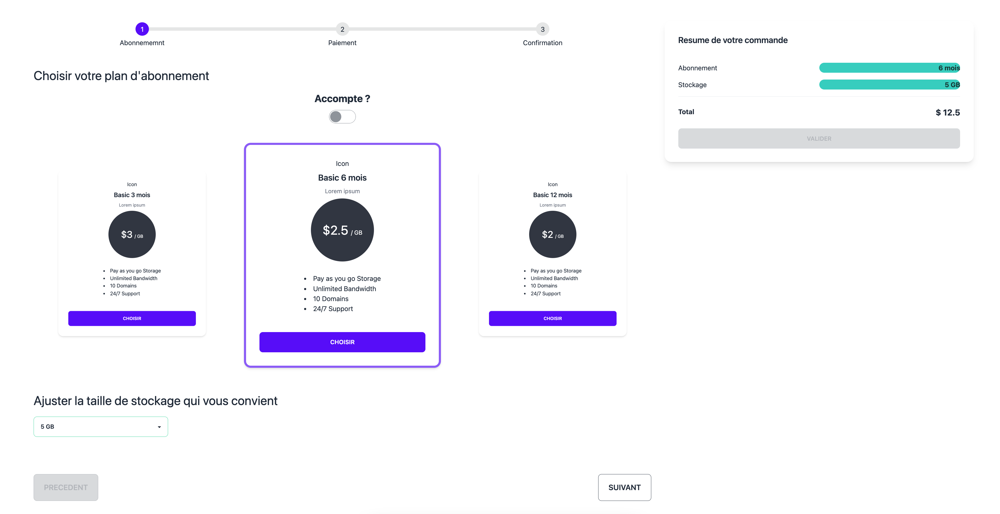
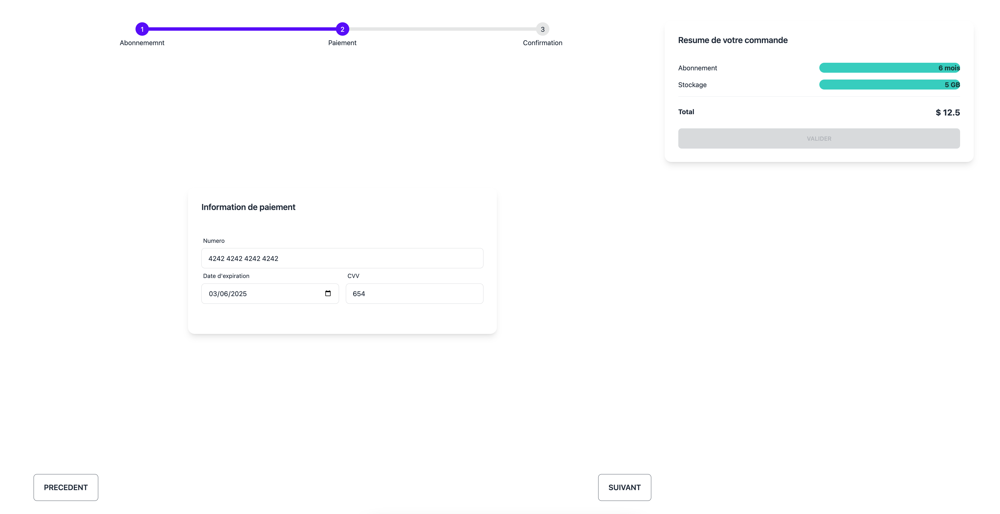
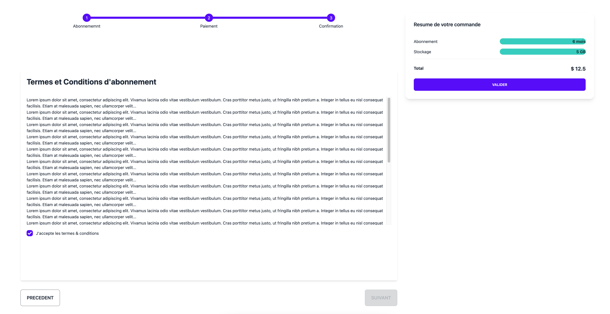
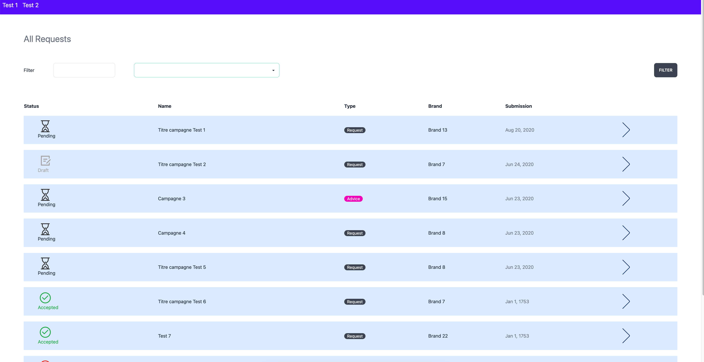
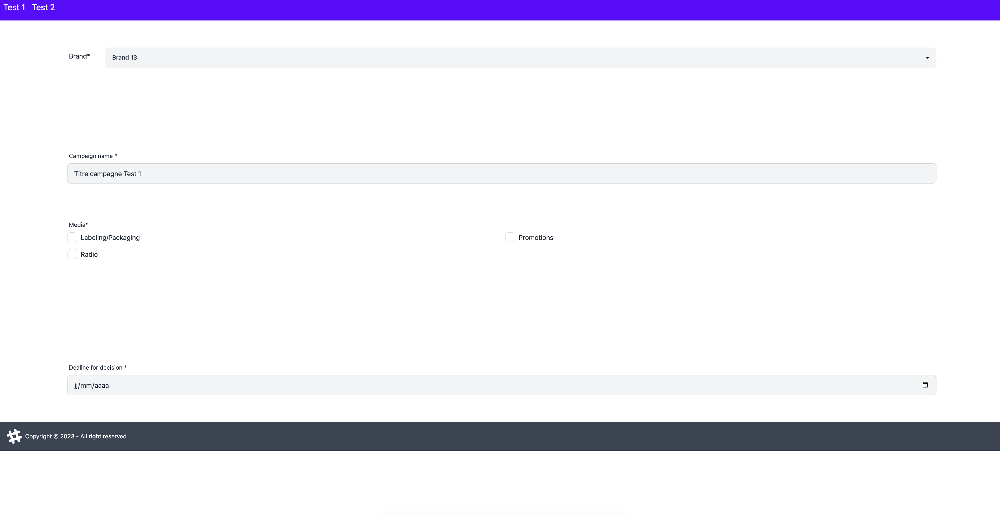
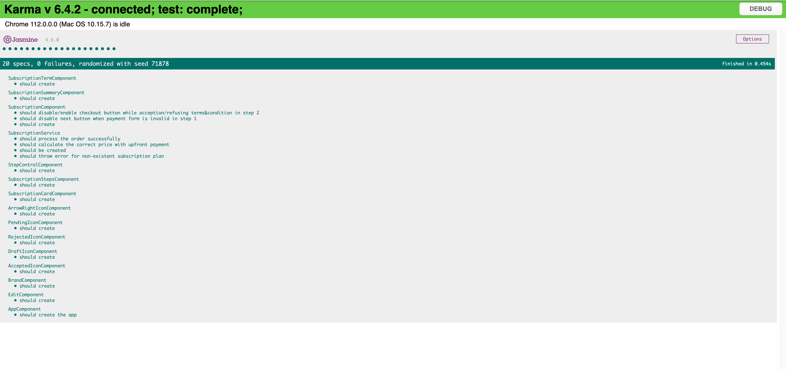

# DevTest Collaboration Capital

This project is the result of work from the two Frontend Angular tests:
- [Test 1](https://docs.google.com/document/d/1msBhjmLZMrNotEvalHpyyVyR3AyJfRV3lUu7IrnVgR0/edit?usp=sharing&urp=gmail_link)
- [Test 2](https://docs.google.com/document/d/1Z-jpjRguZe0_UgybiLgKB_WXKQNmaDT2EO57A_s7SAY/edit)

## Installation
**yarn** is the prefered package manager used for this project but you can use your favorite one (npm, pnpm, etc)

*To install required dependencies*
`yarn install`

*To start the server*
`yarn start` then visit [http://localhost:4200]

To start karma test
`yarn test`

## Try-On
- visit [http://localhost:4200/subscription] for Test 1
- visit [http://localhost:4200/brand] for Test 2

## Screenshots
### Test 1

### Test 2

> Don't worry there is a basic navigation inside the app

## Testing
I write some component testing, service testing. All of them are green (passed)

## Technologies
- Angular 15 (latest)
- Rxjs
- [Tailwindcss](https://tailwindcss.com)
- [Daisyui](https://daisyui.com)
